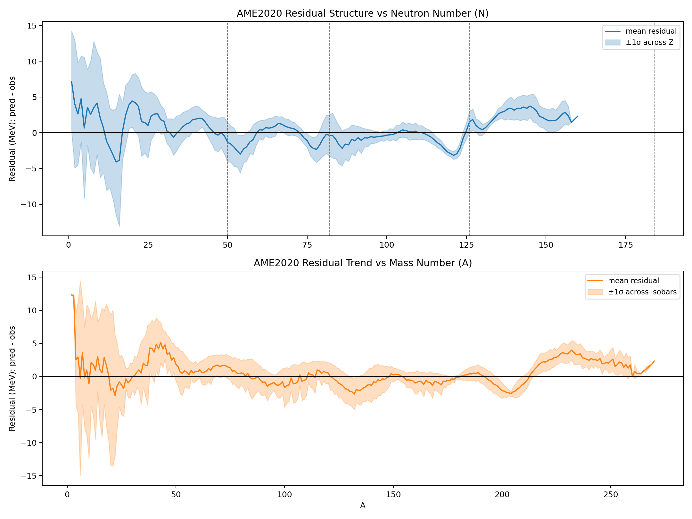

# Finding 027 — AME2020 Mass Baseline And Residual Structure

Date: 2026-02-25

## Summary

We benchmarked the current GUTOE nuclear scanner against AME2020 (`mass_1.mas20`).
The scanner is now evaluated on measured binding energies directly (not only isotope counts/shell-gap proxies).

Current baseline (2,548 matched nuclides in scan range):

- `RMSE = 3.2336 MeV`
- `MAE = 2.1655 MeV`
- `Bias = +0.1677 MeV`

This run uses the current shell lane with Strutinsky enabled plus the SEMF bias correction (`a_v` reduction).

## Key Output Files

Generated under `/tmp/nuclear_chart`:

- `ame2020_benchmark.json`
- `ame2020_residuals.csv`
- `ame2020_residuals_top50.csv`
- `ame2020_residual_structure.png`

## Residual Structure Plot



Interpretation in this baseline:

- `N=50` mean residual is negative (underbinding tendency).
- `N=82` is near anchor.
- `N=126` is positive (overbinding tendency).

This structured pattern is now an explicit target for gradient reduction (especially `N=50` up, `N=126` down) while preserving the improved global AME RMS.

## Reproduction

From repo root:

```bash
./scripts/nuclear_artifact_bundle.sh
```

This regenerates periodic stats, AME benchmark, residual plot, and assembles a bundle in `/tmp/nuclear_chart_bundle`.
